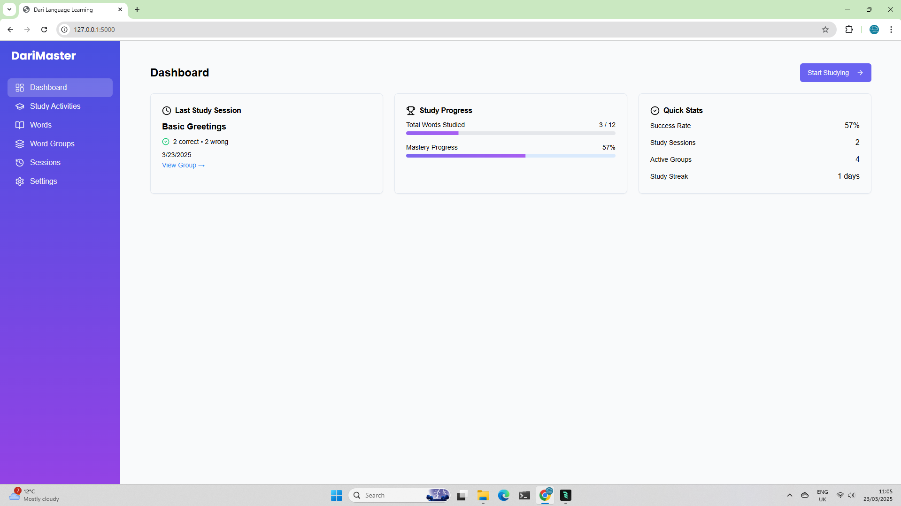
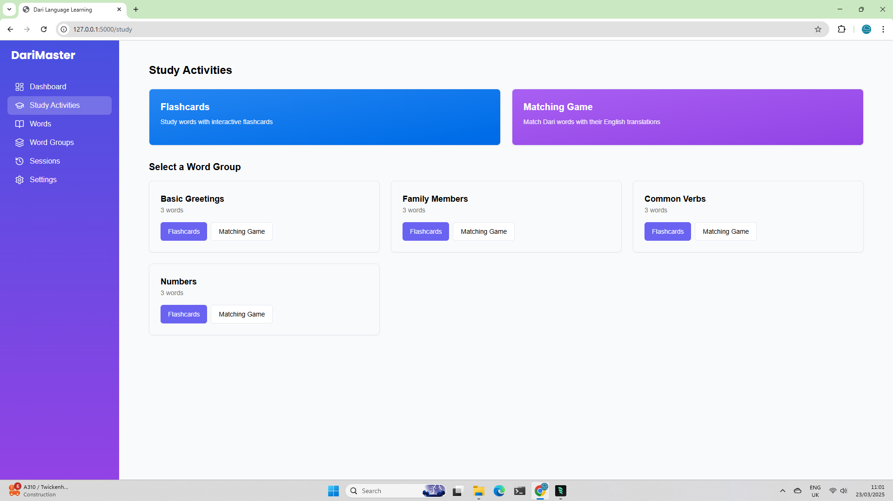
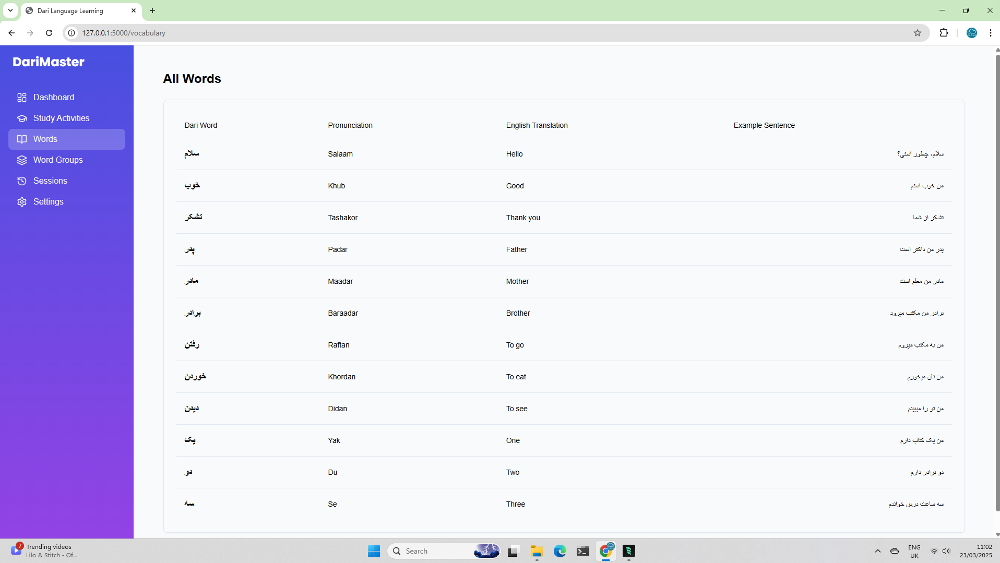
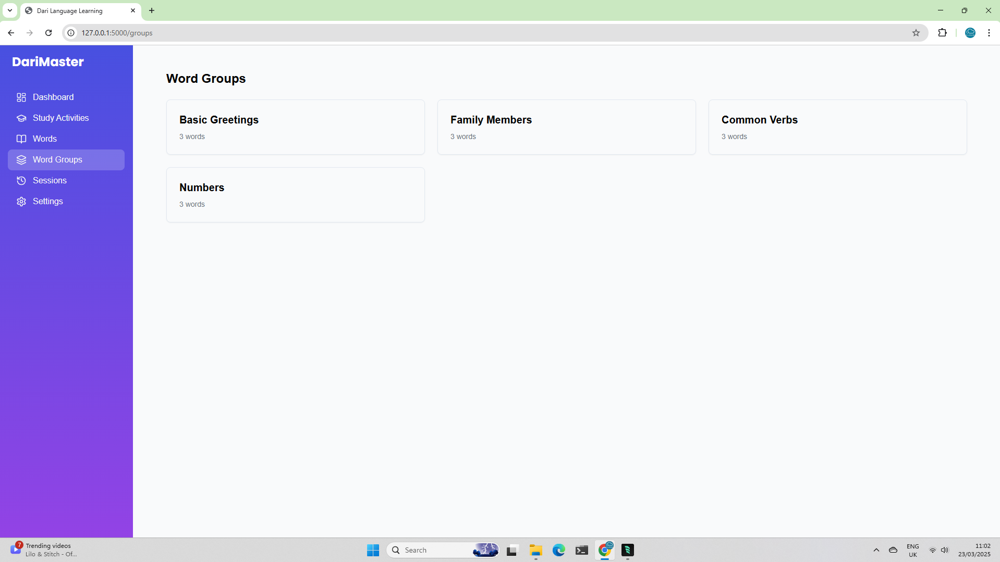
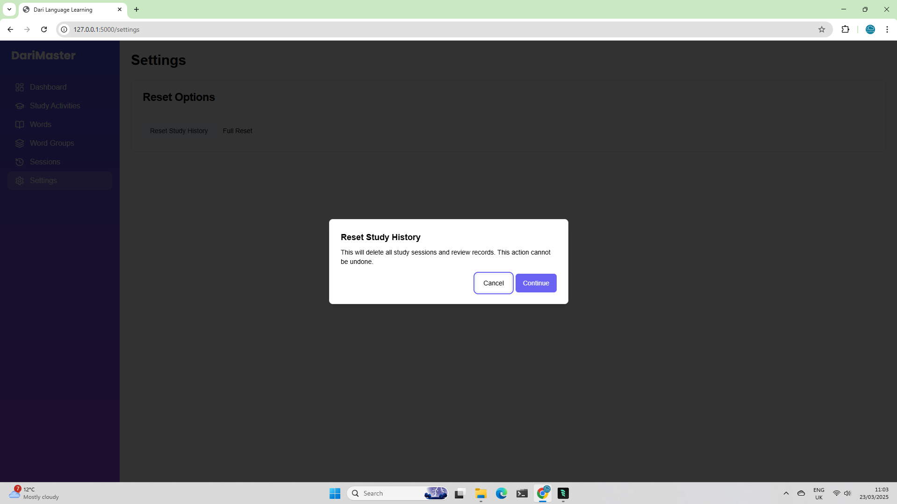
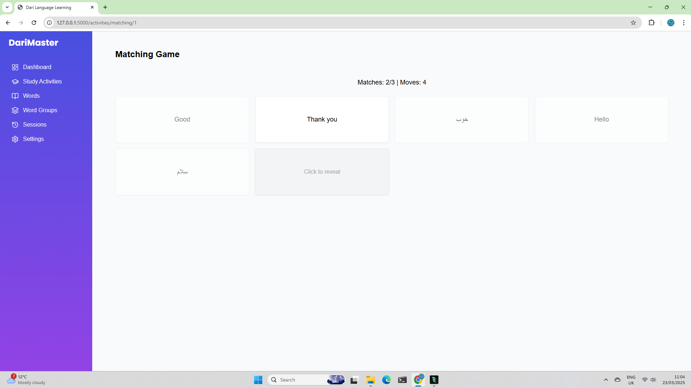
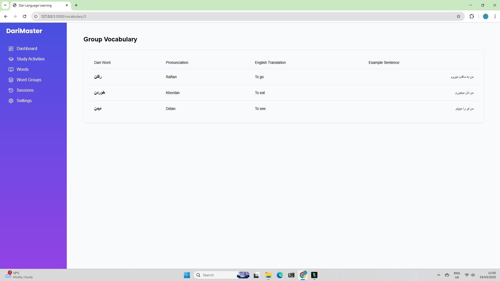
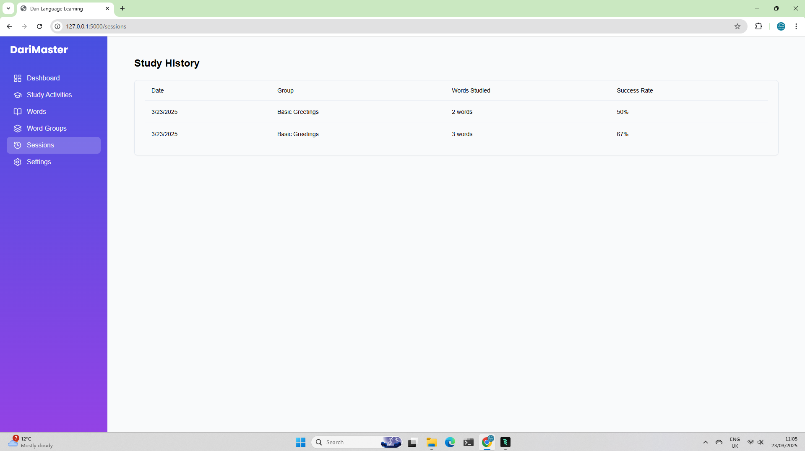

# 🌟 Free GenAI Bootcamp 2025 🌟
## 6 Weeks Of Free Online GenAI Training And Hands-on Programming

<div align="center">
  
  ***Learn, Code, Create: Transforming Language Learning with AI***
  
  
  
  
  
  
</div>

---

This repository contains projects developed during the 2025 GenAI Bootcamp, focusing on practical applications of generative AI and language technologies, particularly for Persian/Dari language learning.

## 🏗️ GenAI System Architecture


*This architecture diagram illustrates our approach to building a cost-effective, privacy-focused AI system for language learning. We've designed this solution around open-source models (like IBM Granite) that can run on dedicated AI hardware, avoiding ongoing API costs while maintaining control over student data. The system supports 300 simultaneous users and integrates our own proprietary learning materials to address copyright concerns. This self-hosted approach offers the perfect balance of performance, privacy, and long-term sustainability for language education.*

## 📅 Weekly Development Progress

### 🔍 Week 0: Project Architecture and Initial Setup
- 📊 Created comprehensive architectural diagrams
- 💬 Developed prompting strategies for multiple LLM platforms
- 🧠 Implemented Sentence Constructor activity
- 🧩 Designed modular architecture for study activities

### 🚀 Week 1: DariMaster Language Learning App
- 💻 Set up full-stack application with Vite, TypeScript, and Express.js
- 🎮 Implemented core features including flashcards and matching games
- 🎨 Created responsive UI with Tailwind CSS and Shadcn/ui
- 🔄 Added RTL support for Dari text

### 🤖 Week 2: Persian Learning Assistant
- 💬 Implemented Chat with Nova system with Persian language support
- 📝 Created transcript processing and vocabulary extraction
- 🔒 Added security enhancements and proper environment configuration
- 🌐 Developed bilingual chat interface

### 🔊 Week 3: Text-to-Speech Microservice
- 🐳 Implemented Docker containerization for TTS services
- 🚀 Created FastAPI endpoints for text-to-speech conversion
- 🎵 Integrated Coqui TTS with custom configuration
- 🔄 Developed audio format conversion utilities

### 🎮 Week 4: Farsi Text Adventure MUD
- 📊 Solved critical issues with Farsi text display
- 🔄 Implemented centralized text processing with normalize_farsi function
- ⚙️ Created custom ArabicReshaper configuration for Farsi
- 🔄 Improved bidirectional text support

### 📱 Week 5: Visual Applications and Tools
- 🎵 Developed Farsi Song Vocabulary Generator with lyric analysis
- 🎬 Created interactive Farsi Learning Visual Novel with bilingual support
- ✍️ Implemented Farsi Writing Practice App with OCR technology
- 🔄 Added comprehensive RTL support across all applications

---

<div align="center">
  
  ## 🚀 Projects Overview
  
</div>

### 1️⃣ Farsi Text Adventure MUD Game (fa-mud)
A text-based adventure game that helps users learn Farsi vocabulary through an immersive MUD (Multi-User Dungeon) experience.

**Key Features:**
- 🎮 Command flow: User Input → Parser → Game Engine → Response Gen → UI
- 🈯 Exactly one Farsi word per English sentence
- 🔣 13 predefined commands (Look, Move, Take, Drop, Talk, Use, Give, Open, Close, Eat, Inventory, Drink, Help)
- 🔁 RTL support for mixed LTR/RTL text rendering
- 📦 JSON-based vocabulary system

**Technical Stack:**
- 🐍 Python 3.10+
- 📟 Textual for terminal UI
- 🔤 Hazm for Farsi NLP
- 🔣 Arabic-reshaper and python-bidi for text processing
- ⚛️ React frontend with RTL support

### 2️⃣ ASL Finger Spelling Application (finger-spelling)
An interactive application that helps users learn and practice American Sign Language (ASL) finger spelling using computer vision and machine learning.

**Key Features:**
- 👋 Real-time hand tracking and gesture recognition
- 🤟 ASL finger spelling detection and translation
- 🏫 Interactive learning mode for practicing ASL alphabet
- 📊 Performance feedback and accuracy metrics
- 🖥️ User-friendly interface with webcam integration

**Technical Stack:**
- 🖐️ Hand tracking using MediaPipe
- 🧠 Custom TensorFlow model for gesture recognition
- 📷 Real-time image processing with OpenCV
- 🌐 Gradio-based web interface

### 3️⃣ Language Learning Portal (lang-portal)
A comprehensive language learning platform with various activities and tools to help users learn new languages.

**Key Features:**
- 🏫 Interactive language learning modules
- 📈 Progress tracking
- 🔐 User authentication
- 🛣️ Customizable learning paths

**Technical Stack:**
- 🐍 Python backend
- 🗃️ Database integration
- 🌐 Web-based interface
- 🔄 Task automation with Invoke

### 4️⃣ Persian Learning Assistant (listening-comp)
An interactive chat system for learning Persian with transcript analysis capabilities.

**Key Features:**
- 💬 Chat with Nova Implementation
- 📊 Structured Data Processing
- 📝 Transcript analysis
- 📚 Vocabulary extraction with Persian character handling
- 📏 Grammar pattern recognition

**Technical Stack:**
- 🔤 sentence-transformers
- 🔍 faiss-cpu
- ⛓️ langchain
- 🎤 Azure Speech Services

### 5️⃣ Text-to-Speech (TTS) Microservice (opea-comps)
A microservice that combines Coqui TTS with FastAPI to provide text-to-speech conversion through a REST API.

**Key Features:**
- 🔊 Text-to-speech conversion API
- 🐳 Docker containerization
- 🚀 FastAPI integration
- 🔄 Audio format conversion

**Technical Stack:**
- 🐳 Docker and Docker Compose
- 🎵 Coqui TTS service
- 🚀 FastAPI framework
- 🌐 RESTful API design

### 6️⃣ Farsi Song Vocabulary Generator (song-vocab)
An application that analyzes Farsi songs to extract vocabulary for language learning purposes.

**Key Features:**
- 🌐 API for song lyric analysis
- 📚 Vocabulary extraction
- 🔍 SERP integration for song search
- 🧪 Interactive testing tools

**Technical Stack:**
- 🚀 Uvicorn server
- 🤖 Ollama SDK
- 🌐 API endpoints
- 🧪 Testing frameworks

### 7️⃣ Farsi Learning Visual Novel (visual-novel)
A web-based visual novel for learning Farsi, featuring interactive dialogue, language switching, and audio management.

**Key Features:**
- 🌐 Bilingual Support: Switch between English and Farsi text with RTL support
- 🔊 Audio System: Voice acting, background music, and sound effects
- 💬 Interactive Dialogue: Choice-based dialogue system with branching paths
- 👥 Character System: Rich cast of characters with dynamic expressions
- 💾 Save/Load System: Multiple save slots for game progress

**Technical Stack:**
- 📜 Pure JavaScript for game logic
- 🎨 HTML5 and CSS3 for interface
- 🔊 Web Audio API for sound management
- 🚀 Express.js for serving static files
- 🔤 Google Fonts (Noto Naskh Arabic) for Farsi text

### 8️⃣ Farsi Writing Practice App (writing-practice)
A simple and interactive application to help users practice writing in Farsi (Persian) using OCR technology.

**Key Features:**
- 🔄 Random English sentences for translation practice
- 📤 Upload and verify handwritten Farsi text
- 👁️ Real-time OCR processing with Tesseract
- ✅ Immediate feedback on translation accuracy
- 🔣 Proper RTL (Right-to-Left) text display

**Technical Stack:**
- 🐍 Python 3.7+
- 👁️ Tesseract-OCR with Persian language support
- 🌐 Gradio for web interface
- 🔣 Arabic-reshaper and python-bidi for text processing
- 🖼️ Pillow and PyYAML

---

<div align="center">
  
  ## 📸 Reference Images
  
</div>

### 1. Farsi Text Adventure MUD Game (fa-mud)

*The Farsi MUD game features a text-based interface with mixed English and Farsi text, allowing users to explore virtual environments while learning vocabulary.*

### 2. ASL Finger Spelling Application (finger-spelling)


*The ASL application uses computer vision to recognize hand gestures and translate them into letters, with a practice mode for learning.*

### 3. Language Learning Portal (lang-portal)








*The language portal provides a comprehensive dashboard for tracking progress and accessing various learning activities.*

### 4. Persian Learning Assistant (listening-comp)


[Visual Novel Demo Video](listening-comp/reference_images/Listening_Comp_Video.mp4) (download to view)

*The listening comprehension tool analyzes Persian audio and provides vocabulary extraction and grammar pattern recognition.*

### 5. Text-to-Speech (TTS) Microservice (opea-comps)


*The TTS microservice architecture demonstrates the containerized services working together to provide text-to-speech conversion.*

### 6. Farsi Song Vocabulary Generator (song-vocab)

*The song vocabulary tool searches for and analyzes Farsi lyrics to extract useful vocabulary for language learners.*

### 7. Farsi Learning Visual Novel (visual-novel)


[Visual Novel Demo Video](visual-novel/reference_images/video.mp4) (download to view)

*The visual novel presents interactive scenarios with characters and dialogue choices to teach Farsi in context.*

### 8. Farsi Writing Practice App (writing-practice)


*The writing practice app allows users to practice handwritten Farsi and checks accuracy using OCR technology.*

---

## Repository Structure

```
free-genai-bootcamp-2025/
├── fa-mud/                   # Farsi text adventure MUD game
│   ├── backend/              # Python backend for game logic
│   ├── frontend/             # React frontend with RTL support
│   └── README.md             # Project documentation
│
├── finger-spelling/          # ASL finger spelling recognition
│   ├── models/               # ML models for gesture recognition
│   ├── app.py                # Main application
│   └── README.md             # Project documentation
│
├── lang-portal/              # Language learning portal
│   ├── darimasterlan/        # Dari master language app
│   └── README.md             # Project documentation
│
├── listening-comp/           # Persian learning assistant
│   ├── backend/              # Backend services
│   ├── structured_data.py    # Data processing utilities
│   └── README.md             # Project documentation
│
├── opea-comps/               # Text-to-Speech microservice
│   ├── mega-service/         # FastAPI service
│   ├── models/               # TTS models
│   └── README.md             # Project documentation
│
├── song-vocab/               # Farsi song vocabulary generator
│   ├── tools/                # Utility tools
│   ├── tests/                # Testing modules
│   └── README.md             # Project documentation
│
├── visual-novel/             # Farsi learning visual novel
│   ├── assets/               # Audio, backgrounds, characters
│   ├── js/                   # Game engine and logic
│   ├── styles/               # CSS styling
│   └── README.md             # Project documentation
│
├── writing-practice/         # Farsi writing practice app
│   ├── gradio_app.py         # Main application
│   └── README.md             # Project documentation
│
└── README.md                 # Main repository documentation
```

## Getting Started

Each project has its own requirements and setup instructions in its respective directory.

For the Farsi MUD game:
```bash
cd fa-mud
pip install -r requirements.txt
python run_game.py
```
